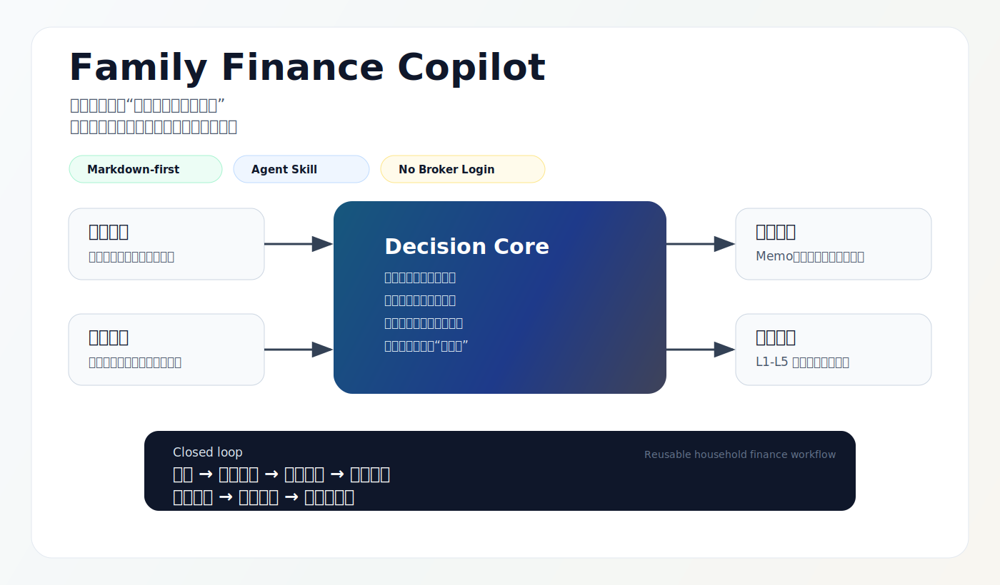
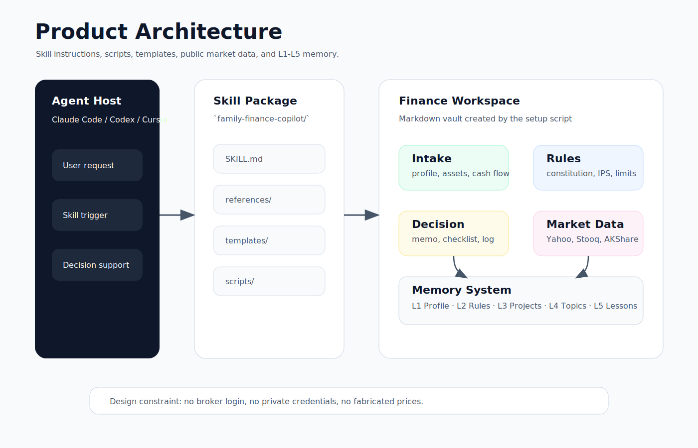

# Family Finance Copilot

> 一个可复用的 Agent Skill，用来搭建 Markdown-first 的家庭财务管理系统。

语言：[English](README.md) | 简体中文

Family Finance Copilot 帮助 AI 编码代理创建并维护一套结构化的家庭财务工作区，覆盖家庭画像、资产负债表、现金流安全、保险与负债、IPS、资产配置、风险桶、投资决策 Memo、操作记录、月度复盘和长期记忆。

它的定位是决策支持与记录系统，不会自动交易，不会登录券商账户，不会保存凭证，也不替代持牌财务、税务、法律或投资顾问。



## 为什么需要它

很多家庭财务工作流不是败在“不会分析”，而是败在信息分散：

一个表格记录资产，一个笔记写交易想法，一个聊天窗口保存推理过程，月度复盘又常常被跳过。过了半年，很难回答这些问题：

- 当时为什么做这个决策？
- 是哪条规则允许它发生？
- 当时的数据是不是最新？
- 什么条件会证明这个决策错了？
- 最后赚钱是因为判断正确，还是只是运气好？

Family Finance Copilot 把这些分散的信息收束成一套可复用的 Agent 工作流。

核心链路是：

```text
家庭安全 -> 数据日期 -> IPS/规则 -> 风险桶 -> 标的证据 -> 行为检查 -> 记录 -> 复盘 -> 记忆
```

这个 skill 会强制 Agent 先看家庭上下文，再讨论任何投资标的。

## 设计原则

### 1. 家庭安全优先于投资机会

skill 内置一条硬规则：

```text
NO INVESTMENT ACTION BEFORE HOUSEHOLD SAFETY, DATA DATE, RISK BUCKET, AND REVIEW DATE ARE CHECKED.
```

它的目的很明确：防止 Agent 从“这个资产看起来不错”直接跳到“可以买”。

### 2. Markdown-first，本地优先

初始化出来的工作区全部是普通 Markdown 文件，可以放在 Obsidian、VS Code、GitHub、Cursor、Claude Code、Codex 或任何文件型工作流里。

不需要数据库，不绑定某个私有应用。

### 3. 记忆是产品层，不是附属记录

生成的工作区内置五层记忆系统：

| 层级 | 作用 |
| --- | --- |
| L1 画像记忆 | 家庭阶段、目标、约束、风险偏好 |
| L2 规则记忆 | IPS、家庭财务宪法、决策规则、工作流 |
| L3 项目记忆 | 进行中决策、待办、当前任务画布 |
| L4 主题记忆 | 资产配置、公司、基金、行业记忆 |
| L5 经验教训 | 复盘教训、行为偏差、长期反模式 |

重点不是保存所有信息，而是沉淀可复用结论，并保留来源、日期、置信度和复核条件。

### 4. 确定性任务交给脚本

skill 内置两个脚本：

- `scripts/init_workspace.py`：创建完整家庭财务工作区。
- `scripts/market_data.py`：使用免费、无 key 的公开行情源查询数据，并输出 JSON。

Agent 应该用脚本处理确定性任务，而不是每次重新手写目录结构或临时拼接口。

### 5. 默认只使用公开免费数据

行情查询默认使用 Yahoo public chart data、Stooq CSV、AKShare、Eastmoney public fund endpoint 等免费/无 key 数据源。

默认不使用券商 OpenAPI、cookie、账户登录、私有 token 或付费数据 API。

## 产品架构



项目由四层组成：

| 层级 | 文件 | 作用 |
| --- | --- | --- |
| Skill 入口 | `SKILL.md` | 触发条件、工作流规则、决策闸门、输出标准 |
| 知识参考 | `references/` | 家庭财务框架与行情数据规则 |
| 确定性工具 | `scripts/` | 工作区初始化、免费行情查询 |
| 可复用产出 | `templates/` | 录入表、IPS、宪法、Memo、操作记录、复盘、记忆文件 |

## 仓库结构

```text
family-finance-copilot/
├── SKILL.md
├── README.md
├── README.zh-CN.md
├── manifest.json
├── examples.md
├── quality_check.md
├── docs/
│   └── assets/
│       ├── overview.svg
│       └── product-architecture.svg
├── references/
│   ├── framework.md
│   └── market_data.md
├── scripts/
│   ├── init_workspace.py
│   └── market_data.py
├── templates/
│   ├── 家庭基础信息录入表.md
│   ├── 资产负债表.md
│   ├── 现金流预算.md
│   ├── 家庭财务宪法.md
│   ├── 投资政策声明IPS.md
│   ├── 投资决策Memo.md
│   ├── 操作记录.md
│   ├── 月度家庭财务复盘.md
│   ├── 资产配置记忆.md
│   ├── 记忆注册表.md
│   ├── 当前任务画布.md
│   └── 财务复盘教训.md
└── evals/
    └── evals.json
```

## 安装方式

### 方式 A：通过 `npx skills` 安装

可以。项目发布到 GitHub 后，只要用户的 agent host 被 Skills CLI 支持，就可以通过 `npx skills` 安装。

如果这是单 skill 仓库：

```bash
npx skills add yeyulangzi/family-finance-copilot
```

如果未来一个仓库里包含多个 skill：

```bash
npx skills add yeyulangzi/family-finance-copilot --skill family-finance-copilot
```

安装后需要重启或刷新 agent host，让它重新发现 skill。

注意：不同 agent 读取 skill 的目录可能不同。如果 CLI 显示安装成功，但 agent 看不到 skill，请检查安装位置和该 agent 的 skill 目录。

### 方式 B：通过 GitHub CLI 安装

GitHub CLI 的 `gh skill` 命令目前处于公开预览。你的环境支持时，可以从 GitHub 仓库安装，并指定目标 agent：

```bash
gh skill install yeyulangzi/family-finance-copilot family-finance-copilot --agent codex
gh skill install yeyulangzi/family-finance-copilot family-finance-copilot --agent claude-code
```

请用下面命令确认你当前 GitHub CLI 支持的准确参数：

```bash
gh skill --help
```

### 方式 C：手动安装

把整个 skill 文件夹复制到你的 agent skill 目录即可。

常见路径：

```text
~/.codex/skills/family-finance-copilot/
~/.claude/skills/family-finance-copilot/
~/.agents/skills/family-finance-copilot/
```

目录根部必须包含 `SKILL.md`。

## 快速开始

创建一个新的家庭财务工作区：

```bash
python scripts/init_workspace.py \
  --target ~/FamilyFinanceVault \
  --household-name "Sample Household" \
  --currency CNY
```

脚本会生成：

- 录入表；
- 家庭画像；
- 资产负债表；
- 现金流预算；
- 家庭财务宪法；
- IPS；
- 投资决策 Memo 模板；
- 操作记录模板；
- 月度复盘模板；
- L1-L5 记忆系统；
- 记忆注册表和当前任务画布。

优先填写这几个文件：

1. `00-录入表/家庭基础信息录入表.md`
2. `01-家庭档案/资产负债表.md`
3. `02-规则与IPS/家庭财务宪法.md`
4. `02-规则与IPS/投资政策声明IPS.md`

## 行情数据查询

查询报价或历史数据：

```bash
python scripts/market_data.py quote --symbol AAPL --source yahoo
python scripts/market_data.py history --symbol 600519.SS --source yahoo --range 1mo --interval 1d
python scripts/market_data.py history --symbol aapl.us --source stooq --interval d
python scripts/market_data.py fund --code 000001 --source eastmoney
```

每次成功返回都会包含：

- 数据源；
- symbol/code；
- 获取时间；
- 原始数据字段；
- 关于延迟、覆盖范围或公开数据可靠性的 caveat。

如果数据源失败，脚本会返回错误，并明确提醒 Agent 不要编造当前价格。

## 示例 Prompt

```text
Use family-finance-copilot to set up a new household finance workspace under ./demo-vault.
```

```text
I want to buy a new fund, but my balance sheet is not updated. Can you decide whether you can give me a buy recommendation?
```

```text
Look up AAPL recent market data using a free source and prepare a note that can be pasted into an investment memo.
```

```text
Create a monthly household finance review and update allocation memory if there is a durable conclusion.
```

## 这个 Skill 会拒绝做什么

它不应该：

- 自动交易；
- 登录券商账户；
- 抓取私人账户页面；
- 保存凭证、cookie、API key 或 `.env` 文件；
- 编造缺失的资产、持仓、价格或日期；
- 提供法律、税务、遗产规划或受监管投资建议；
- 在关键家庭数据缺失时给出强买入/卖出建议。

## 隐私边界

本仓库不包含任何真实家庭资产、个人姓名、券商账户、持仓、交易历史、cookie、token 或私有 API key。

生成的工作区是本地文件。用户需要自行决定保存哪些财务数据，以及是否同步到云端。

## 质量状态

见 [quality_check.md](quality_check.md)。

当前已检查：

- `SKILL.md` 以 `Use when` 开头；
- `SKILL.md` 小于 500 行；
- 确定性任务已放到脚本；
- references 和 templates 采用渐进式加载；
- 初始化工作区内置 L1-L5 记忆系统；
- 免费/无 key 行情查询返回 source 和 timestamp；
- 包内已移除敏感个人数据。

## Roadmap

- 增加更多公募基金数据适配器，并明确公开数据源 caveat。
- 增加已有家庭资产表的 CSV 导入路径。
- 为内置 eval prompts 增加 benchmark 输出。
- 增加理财顾问/客户协作和单家庭自用场景示例。
- 增加 release tags，方便用户通过 skill package managers 固定版本安装。

## 免责声明

本项目用于教育、工作流自动化、记录管理和决策支持，不构成财务、法律、税务或投资建议。任何财务决策前，请使用官方来源复核数据。

## License

MIT。见 [LICENSE](LICENSE)。
